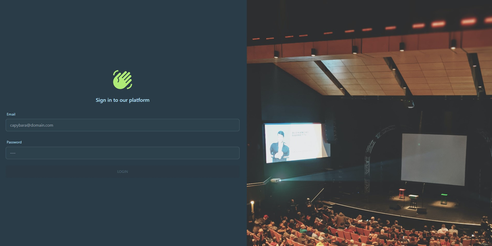

<h1 align="center">Association Manager Angular Front-end</h1>
<h4 align="center">Mael KERICHARD (@Pixselve) - Romain BRIEND (@Yami2200)</h4>
<p align="center">
   
   
   
</p>

---

This project provides a web Front-end made with Angular for managing associations services provided by a [REST API](https://github.com/pixselve-school/tp1-wm). 
The user interfaces provide all tools you need to interact with, edit and display data from the API.

## ✨ How to use

We released a Docker image for anyone to use. It is available
on [GitHub Packages](https://github.com/pixselve-school/tp1-wm/pkgs/container/tp1-wm).

```bash
docker run -p 4200:4200 ghcr.io/pixselve-school/wm-projet:main
```

Or use a `docker-compose.yml` file:

You can find a complete docker compose file including the frontend and backend, a RabbitMQ instance, a PostgreSQL and a
SMTP server in the [projet-al](https://github.com/pixselve-school/projet-al) repository. (REQUIRED for feature like : email verification)


## 🧱 Build from source

### Requirements

- Node.js

### Installation

```bash
git clone
cd wm-projet
npm install
```

### Configuration

The configuration is done through environment variables in the file src/environments/environment.ts. 

### Development

```bash
npm run start
```
Navigate to `http://localhost:4200/`.

### Building

```bash
npm run build
```

### Running Tests

```bash
npx cypress run
```

Required : the app must be running on port 4200 and connected to backend.


Expected Output :


## 📕 Project Details:

### 🏠 Architecture :


Legend : 
- Red components : page component
- Green component : component used by pages
- Purple component : layout component once logged in
- Grey circle : component accessible only when logged in

### 📃 Pages :

#### Login :

> 🚗 Routes : 
>- /login
>- / -redirect if not signed in-> /login
>
> 🧰 Components :
> - **main :** login



The login page of our project is the gateway to accessing the rest of the application. 
It is designed to be simple, with a form for entering your email and password. 
Before logging in, it is mandatory to verify your email address. 
You cannot register an account without being logged in. We have made this decision for security purposes because once you are logged in, you will have full access to the application.

#### Email verification :

> 🚗 Routes :
>- /verify
>
> 🧰 Components :
> - **main :** verification


The verification page is used to verify the email address of new user accounts. 
When a user creates an account, they receive an email with a verification link. 
When they click on this link, they are directed to the verification page. 
On this page, the verification component reads the URL parameter and sends a post request to the API to verify the address.
(2) If the token is found and is linked to an unverified account, the account will be verified and the user will be able to log in.
(1) If the token is linked to a verified account, the user will see a message indicating that the account has already been verified.
(3) If the token is not found by the API, an error message will be displayed.

#### Users Home :

> 🚗 Routes :
> - /users
> - / -redirect if signed in-> /users
> 
> 🧰 Components :
> - **main :** users-list
> - (1) search-user
> - (2) logged-layout
> 
> 📌 Modals :
> - new-user-modal
>


The users list page displays a list of all users of the application, as well as some statistics about the users such as the total number of users, the mean age of the users, and the age range. 
The page also includes a search bar component called "search-user" which can be useful for searching for specific users or checking if a particular user ID exists. 
Each user in the list is displayed with their first name, last name, and age, and there is a button to view the user's profile in more detail. 
From this page, you can also create a new user by clicking on the button above the list, which will open the "new-user-modal" component.

#### Create User Modal :


The create user modal is a component that is displayed in a modal when the user clicks on the "Create User" button on the users list page.
It contains a form for creating a new user. 
The form contains fields for the user's first name, last name, email address, age and password.

#### User Profile :

> 🚗 Routes :
> - /users/:id
> 
> 🧰 Components :
> - **main :** user-profile
> - (1) logged-layout


The user profile page displays information about the current user who is logged in. This information is presented in a form that allows the user to edit any of their data and save the changes by clicking on the "Update my profile" button.

#### User Details :

> 🚗 Routes :
> - /users/:id
> 
> 🧰 Components :
> - **main :** user-details
> - (1) logged-layout
> - (2) association-card


The user details page displays information about a specific user, including their first name, last name, and age. 
The page also displays a list of all associations that the user is a member of. 
Each association is displayed using an "association-card" component, which includes a button to view more details about the association on the association detail page.

#### Associations Home :

> 🚗 Routes :
> - /associations
> 
> 🧰 Components :
> - **main :** association-list
> - (1) search-association
> - (2) logged-layout
> 
> 📌 Dialogs :
> - new-association-dialog


The associations details page displays a list of all associations, along with specific information such as the name and list of members for each association. 
You can click on the details button for each association to view more information on the association details page. 
The page also includes a search bar component called "search-association" which allows you to search for an association using a specific ID. 
Additionally, there is a "New association" button above the list that will open a dialog for creating a new association.

#### Create Association Dialog :


The create association dialog is a component that is displayed in a dialog when the user clicks on the "New association" button on the associations list page.
It contains a form divided into 4 steps for creating a new association.
The form contains field for the association's name. 
You can then add custom role. For the third step, you can add members by searching for their id. The final step is a recap.

#### Association Details :

> 🚗 Routes :
> - /associations/:id
>
> 🧰 Components :
> - **main :** association-detail
> - (1) logged-layout
>
> 📌 Dialogs & Modals :
> - add-event-modal
> - add-user-modal
> - add-role-modal
> - new-minute-dialog


The association details page displays information about a specific association, including its name and lists of members, minutes, and events. 
For each member, you have the option to edit their role or remove them from the association. 
You can also view, remove, and add minutes using the "New" button, which will open the "new-minute-dialog" dialog. Similarly, you can view, remove, and add events using the "Add" button, which will open the "add-event-modal" modal.

#### Add Event Modal :


The add event modal is a component that is displayed in a modal when the user clicks on the "Add" button on the association details page.
It contains a form for creating a new event.
The form contains fields for the event's name, start and end date and time.

#### Add User Modal :


The add user modal is a component that is displayed in a modal when the user clicks on the "Add" button on the association details page.
It contains a search bar for searching for a user by ID.
When the user is found, the form will display the user's first name, last name and its status : already in the association, not found, available to add.
You can also specify the role of the new member.

#### Add Role Modal :


This modal displays a simple text input to change the role of a member.

#### New Minute Dialog :


The new minute dialog is a component that is displayed in a dialog when the user clicks on the "New" button on the association details page.
It contains a form for creating a new minute.
The form contains fields for the minute's content and date.
You can also select voters members for the minute.
